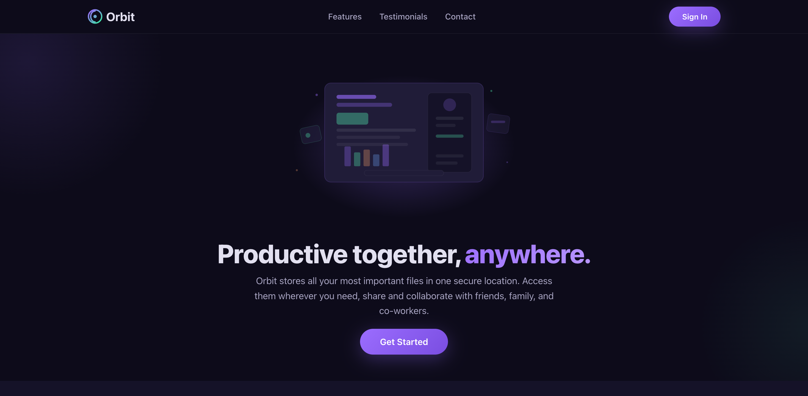

# Orbit

A landing page for a file storage and collaboration platform built with vanilla HTML, CSS, and
JavaScript.

[https://farzanuddin.github.io/orbit/](https://farzanuddin.github.io/orbit/)



## Objective

The goal of this project was to build a polished, responsive landing page from scratch without any
frameworks or build tools — focusing on clean **semantic HTML**, modern **CSS**, and lightweight
**vanilla JavaScript** for interactivity.

## Features

- **Responsive layout** — fully adaptive design that looks great on mobile, tablet, and desktop
- **Scroll animations** — elements fade in as they enter the viewport using the Intersection Observer
  API
- **Scroll-triggered reveal** — reusable `reveal` pattern applied to feature cards and testimonials

## Tech Stack

| Technology                                                            | Role                    |
| --------------------------------------------------------------------- | ----------------------- |
| [HTML5](https://developer.mozilla.org/en-US/docs/Web/HTML)            | Semantic page structure |
| [CSS3](https://developer.mozilla.org/en-US/docs/Web/CSS)              | Styling & layout        |
| [JavaScript](https://developer.mozilla.org/en-US/docs/Web/JavaScript) | Interactivity & DOM API |

## Getting Started

No build step required — it's a pure static site.

1. Open `index.html` in your browser, or serve it locally:

   ```bash
   npx serve .
   ```
